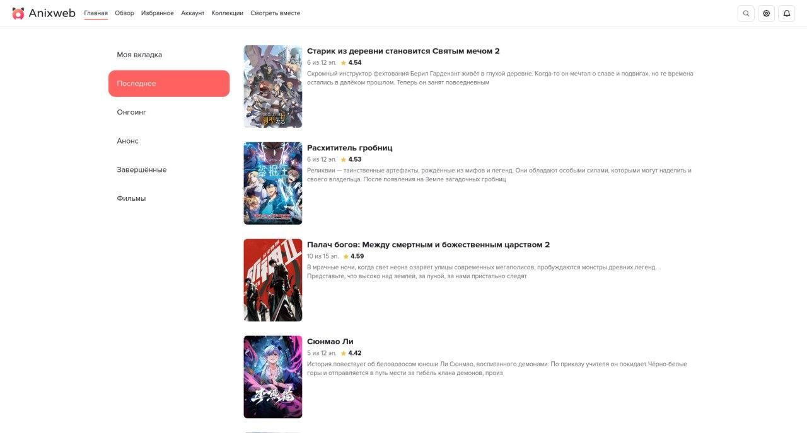

# Anixweb

[English](README_EN.md)

> Проект не связан с разработчиками Anixart и находится в открытом бета-тестировании. Некоторые функции могут работать нестабильно или отсутствовать.

Anixweb — неофициальный веб-клиент мобильного приложения Anixart с собственным плеером, апскейлингом через Anime4K и комнатами совместного просмотра.



## Основные возможности

- Собственный плеер с поддержкой апскейлинга через [Anime4K](https://github.com/bloc97/anime4k)[^1]
- Совместный просмотр в приватных и открытых комнатах
- Авторизация и регистрация аккаунта Anixart
- Списки, коллекции, избранное и история просмотра
- Сохранение времени просмотра серии
- Поиск, фильтры и просмотр франшиз
- Синхронизация с мобильным приложением[^3]
- Светлая и тёмная темы[^2]
- Проксирование изображений, если серверы Anixart недоступны в вашем регионе

## Локальная сборка

```bash
git clone https://github.com/imnottimaq/anixart-web.git
cd anixart-web
npm install
# Сборка сайта
npm run build
# Запуск локального сервера разработки
npm run dev
```

## Ограничения

- Для части функций требуется аккаунт Anixart
- Доступность приложения напрямую зависит от доступности API Anixart
- Некоторые возможности официального приложения пока не реализованы
- Поддержка и дальнейшая разработка проекта не гарантируются
- Регистрация может не работать для адресов, обслуживаемых некоторыми нестандартными почтовыми провайдерами

## Обратная связь

Нашли ошибку или отсутствующую функцию либо хотите предложить улучшение? Откройте [issue](https://github.com/imnottimaq/anixart-web/issues "issue") или создайте pull request.

## Лицензия

Информация о лицензии проекта приведена в файле [LICENSE](LICENSE).

[^1]: Для стабильной работы апскейлинга требуются браузер на базе Chromium и видеокарта RTX 2060, RX 480 или более производительная модель.
[^2]: Приложение изначально оптимизировано для светлой темы, поэтому при использовании тёмной темы могут возникать ошибки.
[^3]: Синхронизация не распространяется на раздел «Моя вкладка», время просмотра серии и выбранную тему.
